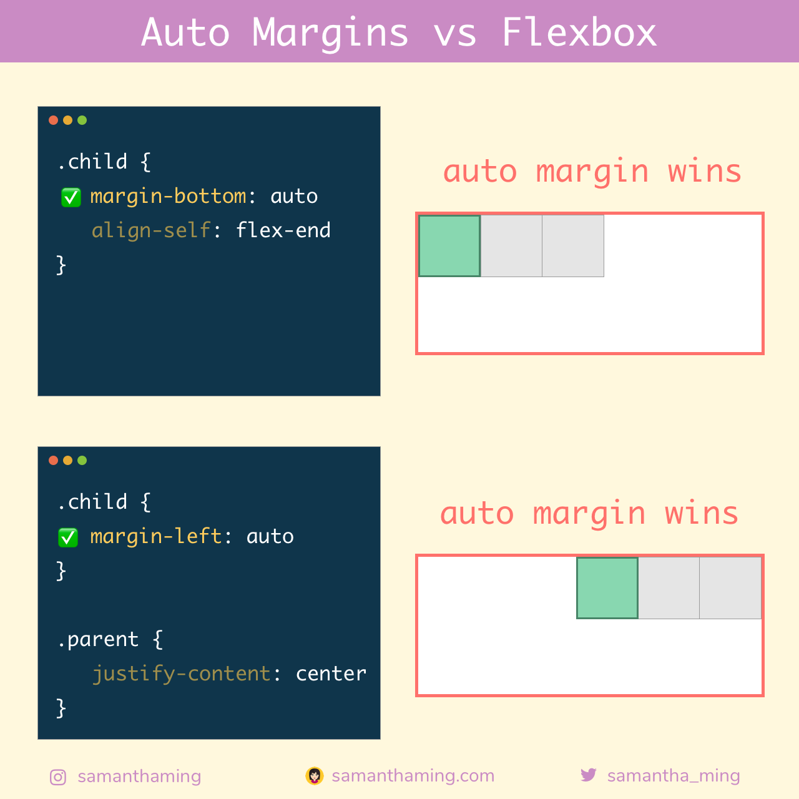

# CSS 奇淫技巧

## 识别 HTML 字符中的 \n

::: tip
`white-space` 属性用于设置如何处理元素中的空白
:::

```css
white-space: pre;
```

|    属性值    | 换行符 | 空格和制表符 | 文字换行 |
| :----------: | :----: | :----------: | :------: |
|    normal    |  合并  |     合并     |   换行   |
|    nowrap    |  合并  |     合并     |  不换行  |
|     pre      |  保留  |     保留     |  不换行  |
|   pre-wrap   |  保留  |     保留     |   换行   |
|   pre-line   |  保留  |     合并     |   换行   |
| break-spaces |  保留  |     保留     |   换行   |

[MDN](https://developer.mozilla.org/zh-CN/docs/Web/CSS/white-space)

## CSS(Unicode 字符) 实现换行

::: tip
在 `Unicode` 中，`0x000A` 字符是专门控制换行的。在 `CSS` 中，我们可以写为 `\A` 或 `\000A` 作为 `after` 伪元素的内容，并添加到指定元素中实现换行效果。
:::

```html
<div>
  <span class="br">前端常用知识软件推荐</span>
  <span class="br">踩坑记录</span>
  <span>各种兼容问题</span>
</div>
```

```css
.br::after {
  content: '\A';
  white-space: pre;
}
```

<style>
.br::after {
  content: '\A';
  white-space: pre;
}
</style>
<div>
  <span class="br">前端常用知识软件推荐</span>
  <span class="br">踩坑记录</span>
  <span>各种兼容问题</span>
</div>

[使用 CSS(Unicode 字符)让 inline 水平元素换行](https://www.zhangxinxu.com/wordpress/2012/03/tip-css-multiline-display/)

## 网页置灰

```css
html {
  filter: grayscale(100%);
  -webkit-filter: grayscale(100%);
  -moz-filter: grayscale(100%);
  -ms-filter: grayscale(100%);
  -o-filter: grayscale(100%);
  /* 兼容 Firefox */
  filter: url("data:image/svg+xml;utf8,<svg xmlns='http://www.w3.org/2000/svg'><filter id='grayscale'><feColorMatrix type='matrix' values='0.3333 0.3333 0.3333 0 0 0.3333 0.3333 0.3333 0 0 0.3333 0.3333 0.3333 0 0 0 0 0 1 0'/></filter></svg>#grayscale");
  /* 兼容 IE */
  filter: progid:DXImageTransform.Microsoft.BasicImage(grayscale=1);
  /*兼容 Chrome Safari Edge 等 */
  -webkit-filter: grayscale(1);
}
```

[一段 css 让全站变灰](https://juejin.cn/post/6844904114053185544)
[filter - CSS —— MDN](https://developer.mozilla.org/zh-CN/docs/Web/CSS/filter)

## Margin-left:auto 快速实现右对齐

当元素本身宽度固定时，设置 `margin-left:auto` 就可以实现右对齐。


如果在`Flex`项目上使用了`auto margin`，那么它的优先级会高于其他地方的对齐属性设置，相当于在其他地方的设置无效了



原因是：如果剩余空间分配给了 `auto margin`，那么对齐属性在那个维度上的设置就会无效， 因为在`flex`项目分配空间位置之前， `margin` 已经用完了所有的剩余空间

[[译]Flexbox：使用 Auto Margin 对齐](https://juejin.cn/post/6844904017357717517)

[探秘 flex 上下文中神奇的自动 margin](https://github.com/chokcoco/iCSS/issues/64)

[深入探讨 JavaScript 实现标签右对齐的多种技巧与实践](https://my.oschina.net/emacs_8659500/blog/16907852)
